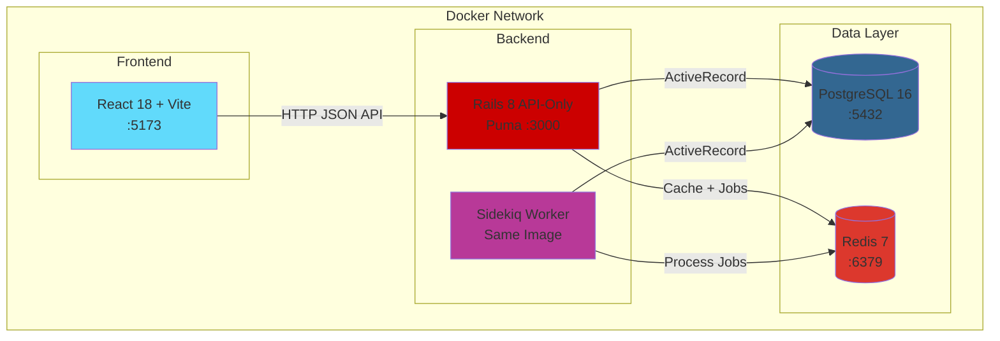
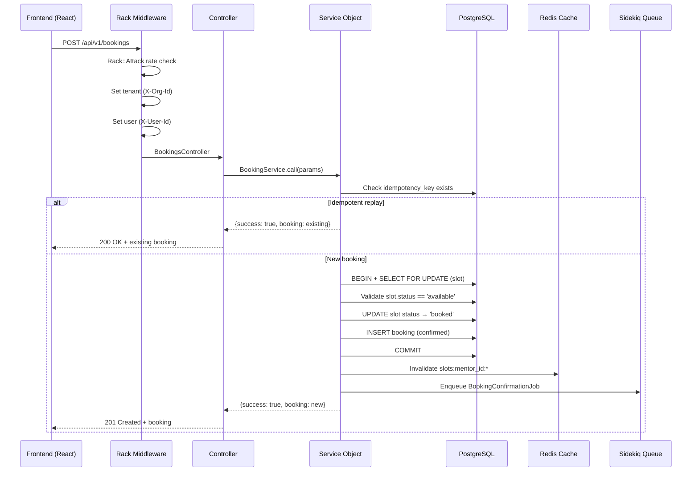
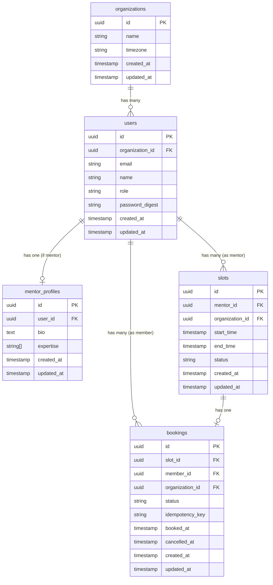

# Technical Design Document — Mentoring Session Booking

## Overview

A full-stack mentoring session booking system for TechMentor, enabling members within multi-tenant organizations to browse mentors, view available time slots, and book concurrency-safe mentoring sessions. The system uses Ruby on Rails 8.0 (API-only) with PostgreSQL 16, Redis 7, and Sidekiq, deployed via docker-compose. The frontend is a React 18 + Vite + Tailwind CSS SPA consuming the JSON API via TanStack Query.

**Key design decisions (post-requirements):**

- **Pessimistic locking** (`SELECT FOR UPDATE`) for slot booking — single-row point locks, sub-50ms transactions, no deadlock risk, no retry loop needed.
- **Two-state slots** (`available` / `booked`) — simpler state machine, no `cancelled` slot status.
- **API-only Rails** (`rails new --api`) — no view layer, no Propshaft/Thruster. Header-based auth stub (`X-User-Id` + `X-Org-Id`).
- **1-hour cancellation window** — bookings cannot be cancelled within 1 hour of slot start_time.
- **Thin but correct vertical slice** — pragmatic choices favoring simplicity over abstraction for a 48-hour exercise.

---

## Architecture

### System Architecture Diagram



### Request Flow



### Layer Responsibilities

| Layer | Responsibility | Example |
|-------|---------------|---------|
| **Rack Middleware** | Rate limiting, CORS, correlation ID injection | `Rack::Attack`, `Rack::Cors` |
| **Controller Concerns** | Auth stub, tenant scoping, parameter parsing | `Authenticatable`, `Tenantable` |
| **Controllers** | HTTP interface, param validation, response rendering | `Api::V1::BookingsController` |
| **Service Objects** | Business logic, transactions, orchestration | `BookingService`, `SlotService` |
| **Query Objects** | Complex read queries with caching | `AvailableSlotsQuery` |
| **Models** | Validations, associations, scopes, enums | `Slot`, `Booking`, `User` |
| **Serializers** | API response shape (Blueprinter) | `BookingBlueprint`, `SlotBlueprint` |
| **Jobs** | Async processing (notifications, cleanup) | `BookingConfirmationJob` |

---

## Components and Interfaces

### Backend Components

#### 1. Controller Layer (`app/controllers/api/v1/`)

```
Api::V1::BaseController
├── #authenticate_user!  (from Authenticatable concern)
├── #set_tenant!         (from Tenantable concern)
├── #current_user
├── #current_organization
└── #render_error(message, status, details: nil)

Api::V1::OrganizationsController < BaseController
├── GET /organizations → #index

Api::V1::AuthController < BaseController
├── POST /auth/select-org → #select_org

Api::V1::MentorsController < BaseController
├── GET /mentors → #index

Api::V1::SlotsController < BaseController
├── GET /mentors/:mentor_id/slots → #index

Api::V1::BookingsController < BaseController
├── POST /bookings → #create
├── PATCH /bookings/:id/cancel → #cancel
├── POST /bookings/:id/reschedule → #reschedule

Api::V1::SessionsController < BaseController
├── GET /me/sessions → #member_sessions
├── GET /me/mentor_sessions → #mentor_sessions

Api::V1::HealthController (no auth)
├── GET /health → #show
```

#### 2. Service Layer (`app/services/`)

```ruby
# BookingService — Core booking logic with pessimistic locking
BookingService
  .call(slot_id:, member:, idempotency_key:)
  → { success: true, booking: Booking } | { success: false, error: String, status: Symbol }

# SlotService — Slot queries with cache-aside
SlotService
  .available_for_mentor(mentor_id:, start_date:, end_date:)
  → [Slot]

# CancellationService — Cancel with window enforcement
CancellationService
  .call(booking:, user:)
  → { success: true, booking: Booking } | { success: false, error: String, status: Symbol }

# RescheduleService — Atomic reschedule (cancel + book in one transaction)
RescheduleService
  .call(booking:, new_slot_id:, user:)
  → { success: true, booking: Booking } | { success: false, error: String, status: Symbol }
```

#### 3. Query Objects (`app/queries/`)

```ruby
# AvailableSlotsQuery — Retrieves available future slots for a mentor
AvailableSlotsQuery
  .new(mentor_id:, start_date:, end_date:)
  .call
  → ActiveRecord::Relation<Slot>
```

#### 4. Serializers (`app/serializers/`)

```ruby
MentorBlueprint       # name, bio, expertise
SlotBlueprint         # id, start_time, end_time, status
BookingBlueprint      # id, status, slot details, mentor/member info
OrganizationBlueprint # id, name, timezone
HealthBlueprint       # status, checks hash
```

#### 5. Background Jobs (`app/jobs/`)

```ruby
BookingConfirmationJob  # Logs confirmation, future: send email
BookingCancellationJob  # Logs cancellation, future: send email
BookingRescheduleJob    # Logs reschedule with old/new slot info
```

#### 6. Controller Concerns (`app/controllers/concerns/`)

```ruby
Authenticatable
  # Reads X-User-Id and X-Org-Id headers
  # Sets Current.user and Current.organization
  # Returns 401 if missing/invalid

Tenantable
  # Calls ActsAsTenant.current_tenant = Current.organization
  # Ensures all queries scoped to org
```

### Frontend Architecture (React 18 + TypeScript + TanStack Query)

#### Project Structure

```
src/
├── api/
│   ├── client.ts          # Axios instance, interceptors, error transform
│   ├── types.ts           # Shared API response/request types
│   ├── mentors.ts         # getMentors, getMentorSlots
│   ├── bookings.ts        # createBooking, cancelBooking, rescheduleBooking
│   └── sessions.ts        # getMySessions, getMyMentorSessions
├── hooks/
│   ├── useMentors.ts      # useQuery + pagination
│   ├── useSlots.ts        # useQuery with staleTime for slot freshness
│   ├── useBooking.ts      # useMutation with optimistic update + rollback
│   ├── useSessions.ts     # useQuery for session lists
│   └── useAuth.ts         # org/user context management
├── components/
│   ├── ui/                # Primitives: Button, Card, Badge, Skeleton, Toast, EmptyState, ErrorState
│   ├── layout/            # AppShell, Navbar, PageHeader
│   ├── mentors/           # MentorCard, MentorGrid
│   ├── slots/             # SlotGrid, SlotButton, WeekNavigation
│   └── sessions/          # SessionCard, SessionList
├── pages/
│   ├── MentorsPage.tsx
│   ├── MentorSlotsPage.tsx
│   ├── MySessionsPage.tsx
│   └── SelectOrgPage.tsx
├── context/
│   └── AuthContext.tsx    # Org + User state, header injection
├── lib/
│   ├── idempotency.ts    # UUID v4 key generation
│   ├── dates.ts          # Timezone-aware formatting (date-fns + org timezone)
│   └── constants.ts      # API URLs, stale times, query keys
└── App.tsx                # Router + QueryProvider + ErrorBoundary
```

#### Frontend Design Patterns

| Pattern | Implementation | Why |
|---------|---------------|-----|
| **Typed API client** | Axios instance with typed response/error interfaces, interceptors for auth headers and error transform | API contract discipline — frontend knows exactly what backend returns |
| **Custom hooks** | Each feature gets a hook (useBooking, useSlots) encapsulating query + mutation + error handling | Separation of data logic from presentation; reusable across components |
| **Optimistic updates with rollback** | `onMutate` → update cache → `onError` → restore previous → `onSettled` → refetch | User sees instant feedback; graceful recovery on failure |
| **Composable UI primitives** | Shared Button, Card, Badge, Skeleton components with variant props | DRY, consistent visual language, accessibility baked in once |
| **Mutually exclusive states** | Each page renders exactly one of: loading, error, empty, or content | No flickering between states; clear user feedback |
| **Error boundaries** | Global ErrorBoundary wraps router; per-route error handling via TanStack Query | Prevents white screen on unexpected errors |
| **Memoization (targeted)** | `React.memo` on list items (MentorCard, SlotButton); `useCallback` for handlers passed as props | Prevents unnecessary re-renders in lists without premature optimization |
| **Accessibility** | Semantic HTML (`button`, `nav`, `main`), ARIA labels on interactive elements, keyboard navigation, focus management after mutations | Inclusive UX; demonstrates full-stack awareness |

#### Data Flow Architecture

```
┌──────────────────────────────────────────────────────┐
│                     App.tsx                           │
│  QueryClientProvider + AuthContext + ErrorBoundary    │
└────────────────────────┬─────────────────────────────┘
                         │
┌────────────────────────▼─────────────────────────────┐
│                   React Router                        │
│  /mentors → MentorsPage                              │
│  /mentors/:id/slots → MentorSlotsPage                │
│  /sessions → MySessionsPage                          │
│  / → SelectOrgPage                                   │
└────────────────────────┬─────────────────────────────┘
                         │
┌────────────────────────▼─────────────────────────────┐
│               Pages (compose hooks + UI)              │
│                                                      │
│  MentorsPage:                                        │
│    const { data, isLoading, isError } = useMentors() │
│    → renders MentorGrid or Skeleton or ErrorState    │
│                                                      │
│  MentorSlotsPage:                                    │
│    const { data } = useSlots(mentorId, dateRange)    │
│    const { mutate, isPending } = useBooking()        │
│    → renders SlotGrid with disabled states           │
└────────────────────────┬─────────────────────────────┘
                         │
┌────────────────────────▼─────────────────────────────┐
│              Custom Hooks (data layer)                │
│                                                      │
│  useBooking():                                       │
│    mutationFn → api.bookings.create(slotId, key)     │
│    onMutate → optimistic cache update (remove slot)  │
│    onError → rollback cache to previous state        │
│    onSuccess → toast + navigate to /sessions         │
│    onSettled → invalidate slot queries               │
└────────────────────────┬─────────────────────────────┘
                         │
┌────────────────────────▼─────────────────────────────┐
│            API Client (typed, intercepted)            │
│                                                      │
│  Request: adds X-User-Id, X-Org-Id headers           │
│  Response: transforms to typed interface             │
│  Error: transforms to { error, details } shape       │
└──────────────────────────────────────────────────────┘
```

#### TanStack Query Configuration

| Query | staleTime | cacheTime | Refetch Strategy |
|-------|-----------|-----------|-----------------|
| Mentors list | 5 min | 10 min | Refetch on window focus |
| Slot availability | 30s | 5 min | Refetch on window focus + interval (60s) |
| My sessions | 1 min | 5 min | Invalidate after booking/cancel/reschedule |
| Organizations | Infinity | Infinity | Fetched once on app load |

#### Key Frontend Decisions

- **No global state library** (Zustand, Redux) — TanStack Query handles server state; AuthContext handles the only client state (selected org/user)
- **No CSS-in-JS** — Tailwind utility classes for speed; consistent design tokens via `tailwind.config.ts`
- **date-fns** for date formatting — tree-shakeable, timezone-aware with `date-fns-tz`, no moment.js bloat
- **React Router v6** — simple route definitions, no nested complexity needed for 4 pages
- **Vitest + React Testing Library** — fast unit tests, test behavior not implementation

### Inter-Component Communication

| From | To | Mechanism |
|------|----|-----------|
| Frontend → API | HTTP JSON | Axios + TanStack Query |
| Controller → Service | Method call | Railway result pattern |
| Service → Database | ActiveRecord | Transactions + locks |
| Service → Cache | `Rails.cache` | Redis via `redis` gem |
| Service → Queue | `perform_async` | Sidekiq + Redis |
| Rack → Controller | Middleware chain | `env` hash mutation |

---

## Data Models

### Entity Relationship Diagram



### ActiveRecord Models

#### Organization

```ruby
class Organization < ApplicationRecord
  has_many :users, dependent: :destroy

  validates :name, presence: true
  validates :timezone, presence: true
end
```

#### User

```ruby
class User < ApplicationRecord
  acts_as_tenant :organization

  has_one :mentor_profile, dependent: :destroy
  has_many :slots, foreign_key: :mentor_id   # only for mentors
  has_many :bookings, foreign_key: :member_id # only for members

  enum :role, { member: "member", mentor: "mentor" }

  validates :email, presence: true, uniqueness: { scope: :organization_id }
  validates :name, presence: true
  validates :role, presence: true

  scope :mentors, -> { where(role: :mentor) }
end
```

#### MentorProfile

```ruby
class MentorProfile < ApplicationRecord
  belongs_to :user

  validates :bio, presence: true
  validates :expertise, presence: true
end
```

#### Slot

```ruby
class Slot < ApplicationRecord
  acts_as_tenant :organization

  belongs_to :mentor, class_name: "User"
  has_one :booking, dependent: :restrict_with_error

  enum :status, { available: "available", booked: "booked" }

  validates :start_time, presence: true
  validates :end_time, presence: true
  validates :status, presence: true
  validate :end_after_start

  scope :available, -> { where(status: :available) }
  scope :future, -> { where("start_time > ?", Time.current) }

  private

  def end_after_start
    return if end_time.blank? || start_time.blank?
    errors.add(:end_time, "must be after start time") if end_time <= start_time
  end
end
```

#### Booking

```ruby
class Booking < ApplicationRecord
  acts_as_tenant :organization

  belongs_to :slot
  belongs_to :member, class_name: "User"

  enum :status, { confirmed: "confirmed", cancelled: "cancelled", completed: "completed" }

  validates :idempotency_key, presence: true, uniqueness: true
  validates :status, presence: true
  validates :booked_at, presence: true

  scope :active, -> { where(status: :confirmed) }
end
```

### Database Constraints & Indexes

| Table | Constraint | Type |
|-------|-----------|------|
| `bookings` | `idempotency_key` | UNIQUE |
| `slots` | `(mentor_id, start_time)` | UNIQUE |
| `users` | `(organization_id, email)` | UNIQUE |
| `slots` | `mentor_id` | INDEX |
| `slots` | `start_time` | INDEX |
| `slots` | `(mentor_id, status, start_time)` | COMPOSITE INDEX |
| `bookings` | `member_id` | INDEX |
| `bookings` | `slot_id` | INDEX |
| `bookings` | `idempotency_key` | INDEX |
| `users` | `organization_id` | INDEX |

### Key Design Notes

- **UUID primary keys** via `pgcrypto` extension — prevents enumeration attacks.
- **No `lock_version` column** — pessimistic locking via `SELECT FOR UPDATE`, not optimistic locking.
- **Two-state slots** — only `available` and `booked`. No `cancelled` slot status.
- **`organization_id` on slots and bookings** — enables `acts_as_tenant` scoping and prevents cross-tenant data leaks.
- **`has_secure_password`** on User for the auth generator scaffold, but credentials are not verified in stub mode.

---

## Correctness Properties

*A property is a characteristic or behavior that should hold true across all valid executions of a system — essentially, a formal statement about what the system should do. Properties serve as the bridge between human-readable specifications and machine-verifiable correctness guarantees.*

### Property 1: Idempotency round-trip

*For any* valid booking payload, submitting the same request with the same `idempotency_key` multiple times SHALL produce the same booking response and SHALL NOT create additional booking records in the database.

**Validates: Requirements 6.5, 6.2**

### Property 2: Pessimistic lock prevents double-booking

*For any* available slot, when N concurrent booking requests target the same slot, exactly one SHALL succeed (creating a confirmed booking) and all others SHALL receive an error indicating the slot is no longer available.

**Validates: Requirements 5.1, 5.8**

### Property 3: Cancellation restores slot availability

*For any* confirmed booking where the slot start_time is more than 1 hour in the future, cancelling the booking SHALL transition the slot status back to `available` and the booking status to `cancelled` atomically.

**Validates: Requirements 7.1, 7.2, 7.3**

### Property 4: Reschedule atomicity

*For any* confirmed booking and any target slot, if the reschedule fails at any step (including new slot unavailable), the original booking SHALL remain in its original `confirmed` state and the original slot SHALL remain `booked`.

**Validates: Requirements 8.2, 8.4**

### Property 5: Tenant isolation

*For any* two organizations A and B, queries executed in the context of organization A SHALL never return users, slots, or bookings belonging to organization B.

**Validates: Requirements 1.2, 1.5**

### Property 6: Cancellation window enforcement

*For any* confirmed booking where the slot start_time is within 1 hour, the cancellation request SHALL be rejected and the booking SHALL remain in `confirmed` status with the slot still `booked`.

**Validates: Requirements 7.6**

### Property 7: Cache consistency after mutation

*For any* successful booking, cancellation, or reschedule operation, the cached slot listing for the affected mentor(s) SHALL be invalidated, such that subsequent slot queries return fresh data reflecting the mutation.

**Validates: Requirements 5.6, 7.5, 8.6**

### Property 8: Booking transaction atomicity

*For any* booking attempt, either BOTH the slot status update AND the booking record creation succeed (committed together), or NEITHER is persisted (rolled back together).

**Validates: Requirements 5.7**

### Property 9: Reschedule preserves booking count

*For any* successful reschedule, the total number of `confirmed` bookings for the member SHALL remain unchanged (one cancelled + one created = net zero change).

**Validates: Requirements 8.1**

---

## Error Handling

### Error Response Format

All 4xx and 5xx responses follow a consistent structure:

```json
{
  "error": "Human-readable error message",
  "details": { "field": "additional context" }
}
```

### Error Classification

| Category | HTTP Status | Example | Handling |
|----------|-------------|---------|----------|
| Validation | 422 | Missing idempotency_key, empty task | Return field-level errors |
| Auth | 401 | Missing X-User-Id / X-Org-Id headers | Return before any business logic |
| Not Found | 404 | Invalid slot_id, booking_id | Standard ActiveRecord::RecordNotFound rescue |
| Conflict | 409 | Slot already booked (lock acquired but status not available) | Return slot unavailable message |
| Rate Limit | 429 | Rack::Attack throttle exceeded | Return Retry-After header |
| Business Rule | 422 | Cancellation within 1-hour window, reschedule of non-confirmed booking | Return specific rule violation |
| Server Error | 500 | Unexpected exception | Log with correlation_id, return generic message |

### Service Result Pattern

Services return a hash — no exceptions for business logic control flow:

```ruby
# Success
{ success: true, booking: booking_record }

# Failure
{ success: false, error: "Slot is no longer available", status: :conflict }
{ success: false, error: "Cannot cancel within 1 hour of session", status: :unprocessable_entity }
```

### Exception Rescue Chain

```ruby
class Api::V1::BaseController < ActionController::API
  rescue_from ActiveRecord::RecordNotFound, with: :not_found
  rescue_from ActiveRecord::RecordInvalid, with: :unprocessable_entity
  rescue_from ActsAsTenant::Errors::NoTenantSet, with: :unauthorized

  private

  def not_found(exception)
    render json: { error: "Resource not found", details: { resource: exception.model } }, status: :not_found
  end

  def unprocessable_entity(exception)
    render json: { error: "Validation failed", details: exception.record.errors.messages }, status: :unprocessable_entity
  end

  def unauthorized(_exception)
    render json: { error: "Organization context required" }, status: :unauthorized
  end
end
```

### Transaction Safety

All mutations wrap related operations in `ActiveRecord::Base.transaction`:

- **Booking**: `SELECT FOR UPDATE` on slot → validate status → update slot → create booking → COMMIT
- **Cancellation**: Update booking status → update slot status → COMMIT (or ROLLBACK both)
- **Reschedule**: `SELECT FOR UPDATE` on new slot → validate → cancel old booking → update old slot → update new slot → create new booking → COMMIT (or ROLLBACK all)

If any step raises within the transaction block, ActiveRecord rolls back the entire transaction automatically.

### Sidekiq Job Resilience

- Jobs enqueued AFTER transaction commit (use `after_commit` or enqueue after service returns success).
- Jobs configured with `sidekiq_options retry: 3` — exponential backoff on failure.
- Dead letter queue for exhausted retries — manual investigation via Sidekiq Web UI.
- Jobs are idempotent by design (logging operations can safely be repeated).

---

## Testing Strategy

### Dual Testing Approach

The system uses both example-based unit tests and property-based tests:

- **Unit tests (RSpec)**: Specific examples, integration points, edge cases, error conditions
- **Property tests (Rantly gem via `rspec-rantly` or `hypothesis`-style)**: Universal properties across generated inputs for core booking logic

### Property-Based Testing Configuration

- **Library**: `rantly` gem with RSpec integration (lightweight, Ruby-native)
- **Iterations**: Minimum 100 per property test
- **Tag format**: `# Feature: mentoring-session-booking, Property N: <property text>`

### Test Categories

| Category | Tool | What It Tests |
|----------|------|---------------|
| Model validations | RSpec + shoulda-matchers | Associations, validations, scopes, enums |
| Service unit tests | RSpec + factory_bot | BookingService, CancellationService, RescheduleService — success/failure paths |
| Property tests | RSpec + rantly | Idempotency, concurrency, atomicity, tenant isolation |
| Controller/request tests | RSpec request specs | HTTP status, headers, response shapes, auth enforcement |
| Concurrency tests | RSpec + threads | Parallel booking attempts against same slot |
| Integration tests | RSpec + full stack | End-to-end booking flow through all layers |
| Frontend unit tests | Vitest + React Testing Library | Component rendering, state management, API integration |

### Hard Path Tests (Priority)

1. **Concurrency**: Spawn 5 threads all attempting to book the same slot. Assert exactly 1 succeeds.
2. **Idempotency**: Submit same booking request 3 times. Assert 1 record created, all responses identical.
3. **Tenant isolation**: Create data in org A, query in org B context. Assert empty results.
4. **Cancellation window**: Attempt cancel at 59 minutes before slot. Assert rejection.
5. **Reschedule rollback**: Attempt reschedule to already-booked slot. Assert original booking unchanged.
6. **Cache invalidation**: Book a slot, then query available slots. Assert booked slot not in results.
7. **Transaction atomicity**: Force failure mid-transaction (e.g., invalid booking data after slot update). Assert slot rolled back to `available`.

### Property Test Implementation

Each correctness property from the design maps to a single property-based test:

```ruby
# Feature: mentoring-session-booking, Property 1: Idempotency round-trip
it "returns same booking for repeated idempotency_key" do
  property_of { # generate random valid booking params
    { slot_id: available_slot.id, idempotency_key: string.call }
  }.check(100) do |params|
    result1 = BookingService.call(**params, member: member)
    result2 = BookingService.call(**params, member: member)
    expect(result1[:booking].id).to eq(result2[:booking].id)
    expect(Booking.where(idempotency_key: params[:idempotency_key]).count).to eq(1)
  end
end
```

### Frontend Testing Strategy

- **Unit**: Component rendering with mocked API (Vitest + MSW)
- **State management**: TanStack Query cache behavior, optimistic updates
- **Error states**: Verify loading/error/empty/content mutual exclusivity
- **No E2E in 48h scope**: Document Playwright as P2

### CI-Compatible Test Execution

```bash
# Backend
bundle exec rspec --format documentation

# Frontend  
npx vitest --run

# Concurrency-specific
bundle exec rspec spec/services/booking_service_concurrency_spec.rb
```
