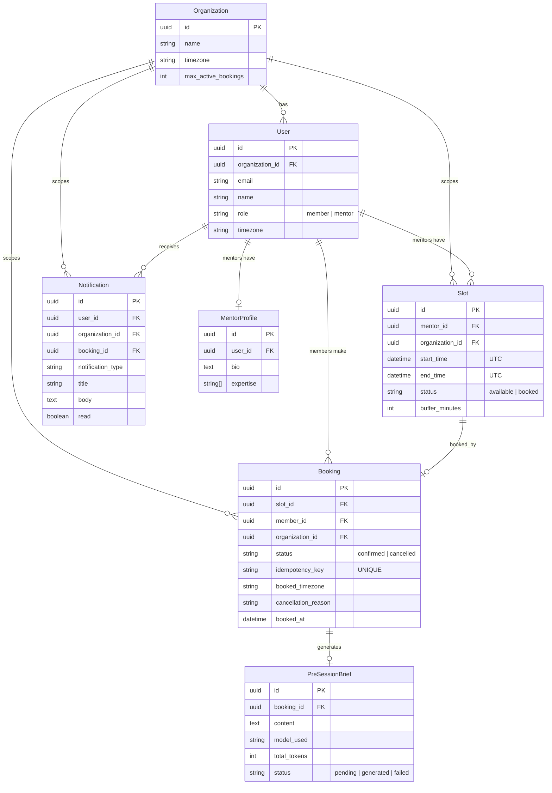
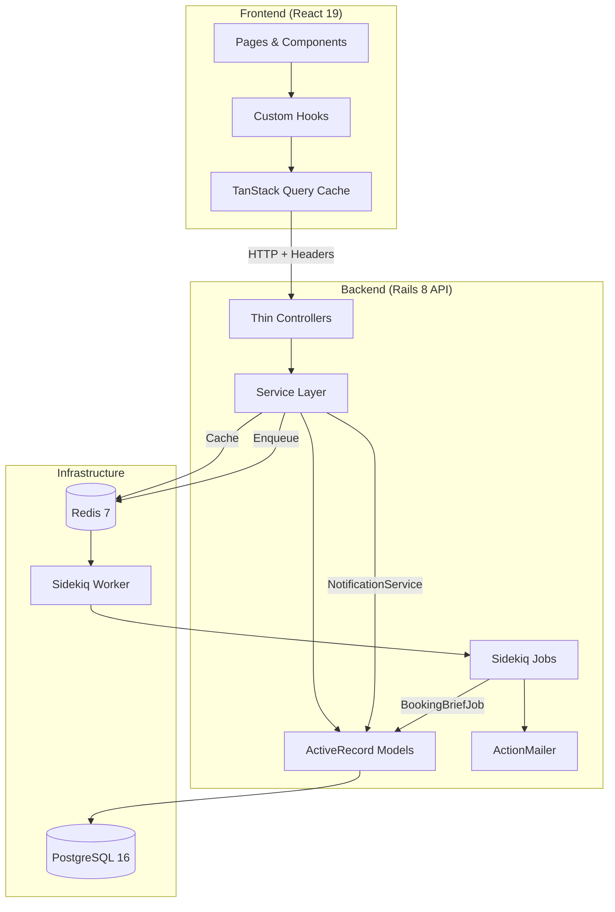
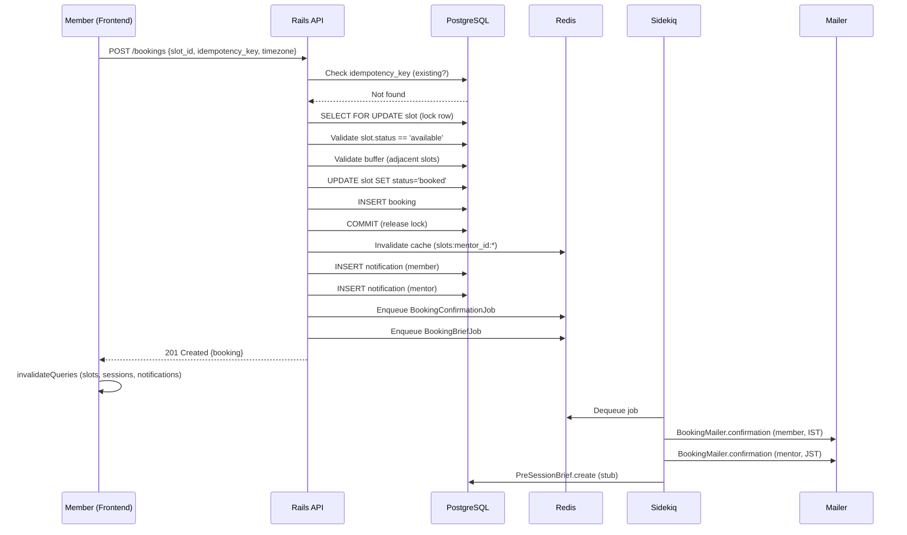
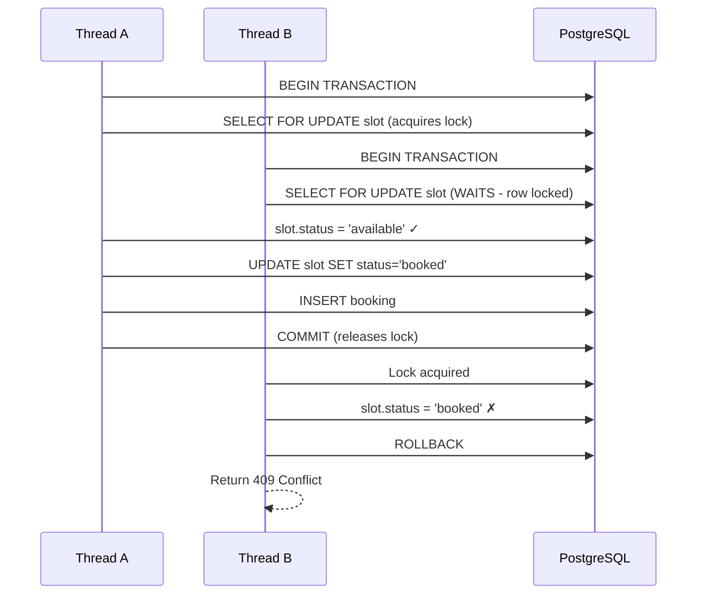

# System Diagrams

## Entity Relationship Diagram

```mermaid
erDiagram
    Organization ||--o{ User : has
    Organization ||--o{ Slot : scopes
    Organization ||--o{ Booking : scopes
    Organization ||--o{ Notification : scopes
    User ||--o{ Slot : "mentors have"
    User ||--o{ Booking : "members make"
    User ||--o{ Notification : receives
    User ||--o| MentorProfile : "mentors have"
    Slot ||--o| Booking : booked_by
    Booking ||--o| PreSessionBrief : generates

    Organization {
        uuid id PK
        string name
        string timezone
        int max_active_bookings
    }

    User {
        uuid id PK
        uuid organization_id FK
        string email
        string name
        string role "member | mentor"
        string timezone
    }

    MentorProfile {
        uuid id PK
        uuid user_id FK
        text bio
        string[] expertise
    }

    Slot {
        uuid id PK
        uuid mentor_id FK
        uuid organization_id FK
        datetime start_time "UTC"
        datetime end_time "UTC"
        string status "available | booked"
        int buffer_minutes
    }

    Booking {
        uuid id PK
        uuid slot_id FK
        uuid member_id FK
        uuid organization_id FK
        string status "confirmed | cancelled"
        string idempotency_key "UNIQUE"
        string booked_timezone
        string cancellation_reason
        datetime booked_at
    }

    Notification {
        uuid id PK
        uuid user_id FK
        uuid organization_id FK
        uuid booking_id FK
        string notification_type
        string title
        text body
        boolean read
    }

    PreSessionBrief {
        uuid id PK
        uuid booking_id FK
        text content
        string model_used
        int total_tokens
        string status "pending | generated | failed"
    }
```

## Service Architecture

```mermaid
flowchart TB
    subgraph Frontend["Frontend (React 19)"]
        UI[Pages & Components]
        TQ[TanStack Query Cache]
        Hooks[Custom Hooks]
    end

    subgraph Backend["Backend (Rails 8 API)"]
        Controllers[Thin Controllers]
        Services[Service Layer]
        Models[ActiveRecord Models]
        Jobs[Sidekiq Jobs]
        Mailers[ActionMailer]
    end

    subgraph Infrastructure
        PG[(PostgreSQL 16)]
        Redis[(Redis 7)]
        Sidekiq[Sidekiq Worker]
    end

    UI --> Hooks --> TQ
    TQ -->|HTTP + Headers| Controllers
    Controllers --> Services
    Services --> Models --> PG
    Services -->|Cache| Redis
    Services -->|Enqueue| Redis
    Redis --> Sidekiq --> Jobs --> Mailers

    Services -->|NotificationService| Models
    Jobs -->|BookingBriefJob| Models
```

## Booking Flow (Sequence)

```mermaid
sequenceDiagram
    participant M as Member (Frontend)
    participant API as Rails API
    participant DB as PostgreSQL
    participant R as Redis
    participant S as Sidekiq
    participant ML as Mailer

    M->>API: POST /bookings {slot_id, idempotency_key, timezone}
    API->>DB: Check idempotency_key (existing?)
    DB-->>API: Not found
    API->>DB: SELECT FOR UPDATE slot (lock row)
    API->>DB: Validate slot.status == 'available'
    API->>DB: Validate buffer (adjacent slots)
    API->>DB: UPDATE slot SET status='booked'
    API->>DB: INSERT booking
    API->>DB: COMMIT (release lock)
    API->>R: Invalidate cache (slots:mentor_id:*)
    API->>DB: INSERT notification (member)
    API->>DB: INSERT notification (mentor)
    API->>R: Enqueue BookingConfirmationJob
    API->>R: Enqueue BookingBriefJob
    API-->>M: 201 Created {booking}
    M->>M: invalidateQueries (slots, sessions, notifications)
    S->>R: Dequeue job
    S->>ML: BookingMailer.confirmation (member, IST)
    S->>ML: BookingMailer.confirmation (mentor, JST)
    S->>DB: PreSessionBrief.create (stub)
```

## Concurrency Safety

```mermaid
sequenceDiagram
    participant A as Thread A
    participant B as Thread B
    participant DB as PostgreSQL

    A->>DB: BEGIN TRANSACTION
    A->>DB: SELECT FOR UPDATE slot (acquires lock)
    B->>DB: BEGIN TRANSACTION
    B->>DB: SELECT FOR UPDATE slot (WAITS - row locked)
    A->>DB: slot.status = 'available' ✓
    A->>DB: UPDATE slot SET status='booked'
    A->>DB: INSERT booking
    A->>DB: COMMIT (releases lock)
    B->>DB: Lock acquired
    B->>DB: slot.status = 'booked' ✗
    B->>DB: ROLLBACK
    B-->>B: Return 409 Conflict
```
